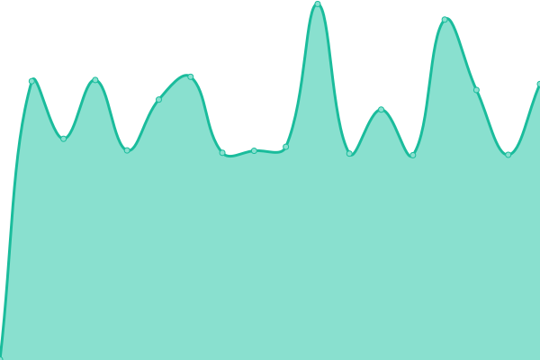
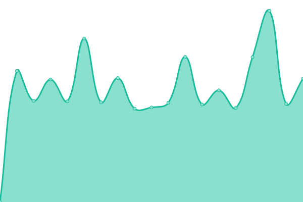

# [📈 Live Status](https://status.sl-streaming.eu): <!--live status--> **🟩 All systems operational**

This repository contains the open-source uptime monitor and status page for [SL Streaming Services](https://status.sl-streaming.eu).

<!--start: status pages-->
<!-- This summary is generated by Upptime (https://github.com/upptime/upptime) -->
<!-- Do not edit this manually, your changes will be overwritten -->
<!-- prettier-ignore -->
| URL | Status | History | Response Time | Uptime |
| --- | ------ | ------- | ------------- | ------ |
|  S1 Germany | 🟩 Up | [s1-germany.yml](https://github.com/Sakretsos/status.sl-streaming.eu/commits/HEAD/history/s1-germany.yml) | 

 594ms
     
 | 

<a href="https://status.sl-streaming.eu/history/s1-germany">100.00%</a>
    

|  S2 Germany | 🟩 Up | [s2-germany.yml](https://github.com/Sakretsos/status.sl-streaming.eu/commits/HEAD/history/s2-germany.yml) | 

 829ms
     
 | 

<a href="https://status.sl-streaming.eu/history/s2-germany">100.00%</a>
    

|  DEV Germany | 🟩 Up | [dev-germany.yml](https://github.com/Sakretsos/status.sl-streaming.eu/commits/HEAD/history/dev-germany.yml) | 

 795ms
     
 | 

<a href="https://status.sl-streaming.eu/history/dev-germany">100.00%</a>
    

<!--end: status pages-->

[**Visit our status website →**](https://status.sl-streaming.eu)

## 📄 License

- Powered by: [Upptime](https://github.com/upptime/upptime)
- Code: [MIT](./LICENSE) © [SL Streaming Services](https://status.sl-streaming.eu)
- Data in the `./history` directory: [Open Database License](https://opendatacommons.org/licenses/odbl/1-0/)
